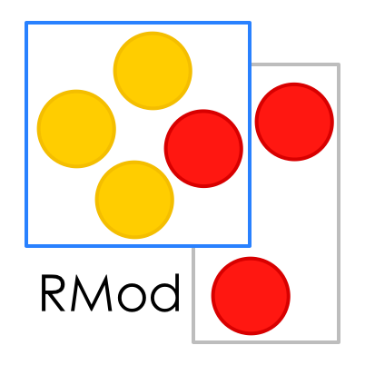

## Edition and Templates

There is also a template system, you can find template in the folder `_support/template`.
Some template are already written, but if you want to have your own, you had two solutions:
- edit the existing template related to the format you want to change (recommanded)
- create your own template with its own name

You will found some template examples in `_support/template` folder to see how it works.
The default template system is Mustache.

Output directory's default name is ''book-result'' but you can change it in the pillar.conf file by editing the
`OUTPUTDIRECTORY` variable





### Example of Sync

Now we can make sure that when we copy some code the checker will report to us if the code changed from the book.

```sync=true&origin=Point >> #degrees
degrees
	"Answer the angle the receiver makes with origin in degrees. right is 0; down is 90."
	| tan theta |
	"I changed this method lhkjhkjhjhk  friend so you should report it"
	^ x = 0
		ifTrue:
			[ y >= 0
				ifTrue: [ 90.0 ]
				ifFalse: [ 270.0 ] ]
		ifFalse:
			[ tan := y asFloat / x asFloat.
			theta := tan arcTan.
			x >= 0
				ifTrue:
					[ y >= 0
						ifTrue: [ theta radiansToDegrees ]
						ifFalse: [ 360.0 + theta radiansToDegrees ] ]
				ifFalse: [ 180.0 + theta radiansToDegrees ] ]
```

